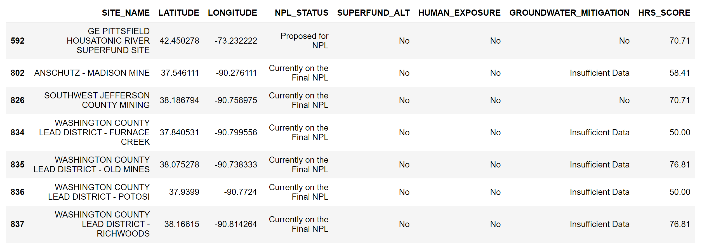
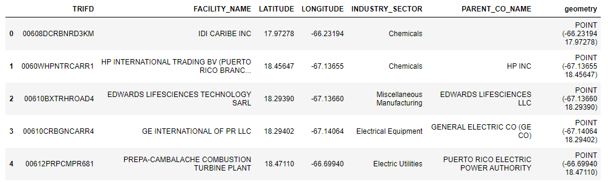
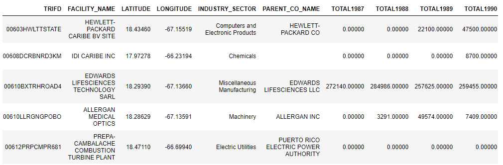
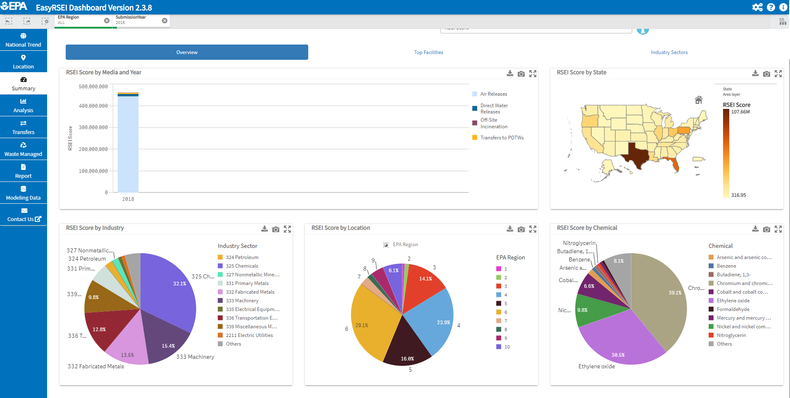

# Exploring Industrial Pollution in the US

## I. Introduction

In 1969, the burning of the Cuyahoga River in Cleveland, Ohio became a national symbol for the public’s outcry against industrial pollution. The public had been expressing increasing concern throughout the 1950s and 1960s, and the US reached a turning point when the Environmental Protection Agency was established in 1970. The EPA began to monitor and enforce the increasing number of environmental laws passed by Congress aimed at reducing industrial pollution.

Today there are two main programs in place that monitor industrial pollution in the United States. The Superfund program is responsible for the investigation and clean-up of contaminated sites left over from decades of unregulated industrial manufacturing and other activities. The most highly contaminated sites which require longer-term remedial action take precedence and are placed on the National Priority List (NPL). The EPA also monitors active facilities all over the country that are currently releasing toxic chemicals into our air, water, and land through the Toxics Release Inventory (TRI).

It is easy enough to obtain basic location information for both Superfund sites and TRI facilities, but an investigation into industrial pollution quickly reveals more complexity beyond locations on a map. This mapping project is a directed narrative told through a storytelling map format that visualizes the general location and distribution of Superfund sites and TRI reporting facilities, and guides the user through several interesting case studies augmented with additional data sources that explore the wider reach and context of these sites. The user will gain a better understanding of industrial pollution and the threat it poses to both humans and the environment. As efforts are underway to [roll back](https://www.vox.com/energy-and-environment/2018/1/26/16936104/epa-trump-toxic-air-pollution) environmental regulations and budget cuts are increasing the [backlog]( https://www.latimes.com/world-nation/story/2020-01-04/backlog-of-toxic-superfund-clean-ups-grows-under-trump) of Superfund remediation projects, this mapping project emphasizes the importance of a framework that regulates and holds industry accountable for the toxic pollution it imposes upon communities.

Find the working map [here](https://eileengrady.github.io/us-industrial-pollution/).

## II. Methodology

### A. Data

Superfund site locations were initially obtained as a csv file from the EPA's [Superfund Enterprise Management System](https://www.epa.gov/enviro/sems-search) Database. Additional data on each site, including the site's Hazard Ranking System (HRS) score, was obtained through an [advanced search](https://cumulis.epa.gov/supercpad/cursites/srchsites.cfm), downloaded as a csv file, and joined to the initial site locations using python in a Jupyter notebook. Based on this additional data, I identified two case studies to focus on in the storytelling map. The first case study focuses on the Southeast Missouri Lead district, a cluster of seven defunct lead mines, and the second case study visits an old General Electric facility in Pittsfield Massachusetts. __These case studies were chosen not only because they are some of the highest ranked sites in the country, but also because they illustrate how far toxic chemicals can spread beyond the site itself.__

Sample of Superfund site data, showing sites chosen for case studies:

Additional data was gathered from individual [Superfund site profiles](https://www.epa.gov/superfund). I was able to determine rivers and watersheds were affected in each case study, and the counties affected in the lead district case study. Rivers were downloaded from [Natural Earth](https://www.naturalearthdata.com/downloads/10m-physical-vectors/), watersheds from [USGS](https://www.usgs.gov/core-science-systems/ngp/national-hydrography/access-national-hydrography-products), and counties from [the Census Bureau](https://www.census.gov/cgi-bin/geo/shapefiles/index.php?year=2019&layergroup=Counties+%28and+equivalent%29), then brought into QGIS to filter and export the necessary features.

I found an [aerial map](https://www.epa.gov/ge-housatonic) of the GE Pittsfield site, georeferenced the image in QGIS, and traced the outlines to create a geojson.

[Toxic Release Inventory](https://www.epa.gov/toxics-release-inventory-tri-program/tri-basic-data-files-calendar-years-1987-2018) data is available for download in .csv format for individual years. After exploring the dataset from 2018, I decided to proceed in four steps:

1. First I downloaded the individual files from each year available, 1987-2018. Data is reported as one record for each chemical released per reporting facility. I used a jupyter notebook to wrangle data into one record per reporting facility in order to export one geojson for 2018 data and one geojson for facilities from all years with release totals for each year. 

Sample of 2018 TRI data:

Sample of TRI data with release totals:

2. The EPA's Risk-Screening Environmental Indicators (RSEI) model adds context to the data reported to the TRI, and can help isolate facilities or chemicals that warrant further investigation. First I used the [EasyRSEI Dashboard](https://edap.epa.gov/public/extensions/EasyRSEI/EasyRSEI.html) to find scores for all facilities in 2018. I found that ethylene oxide emissions were to blame for the high RSEI score in Texas, and also that ethylene oxide had the second highest share of the country's total RSEI score. I used the TRI data files to create two geojsons: (1) facilities releasing chromium/chromium compunds, and (2) facilities releasing ethylene oxide. I looked for patterns in these facilities in QGIS and a jupyter notebook.

3. There are 10 parent companies in the TRI 2018 data that stand out as owning at least 90 facilities. I created  a csv of these companies, through an online search to find each company's headquarters, and geocoded the addresses in a jupyter notebook to create a geojson of parent companies.

4. After outlining the project, I decided I wanted to conclude with an epilogue that showcased TRI facilities within a certain distance of a river. I used a jupyter notebook to find TRI facilities within one-mile of a river, using the geojson created out of 2018 TRI facilities.

### B. Medium for delivery

The mapping project is presented as a storytelling map accessible across desktop and larger mobile devices. The basic technology stack includes HTML, CSS, JS, and [Mapbox GL JS](https://docs.mapbox.com/mapbox-gl-js/api/),using the [Scrollama](https://github.com/russellgoldenberg/scrollama) JavaScript library to create a storytelling experience. [Turf.js](https://turfjs.org/) was also used to create linestrings.

I used a basic example/template to implement the Scrollama library, found [here](https://scrollytelling-edu.herokuapp.com/).

One advantage of using Mapbox GL JS was the ability to create tilesets out of my larger datasets to improve map load time.

### C. Application layout

### D. Thematic representation

As this is a storytelling map format that will guide the user through several 'scenes', there will be several thematic representations. The primary data sources used are Superfund sites and TRI reporting facilities, and are both represented as points throughout the storytelling map Superfund sites are represented as nominal points
using a qualitative color scheme, and TRI facilities are represented both as nominal points using a single color show general distribution, and then as quantitative ratio points (graduated circles) using qualitative colors.

As the narrative develops, additional line and polygon data is brought in to contextualize the sites.

### E. User interaction

The user interaction is a fairly simple scrolling interface. As the user scrolls through panels of descriptive narrative on the left side, the map moves to the relevant location and brings in additional layers to visualize the narrative. Legends are included in the scrolling narrative panels to provide visual continuity between these panels and the map. 

There are two opportunities for the user to interact more deeply with the map, (1) a time slider allows the user to explore changes in the total amount of toxic chemicals released over time, and (2) a dropdown menu allows the user to explore spatial relationships between TRI facilities and their parent company. Both of these UI elements are placed on a scrolling narrative panel and are clearly marked for the user.

### F. Aesthetics and design considerations

This mapping project really embraces the 'storytelling' aspect of a storytelling map. Data is presented in two main 'chapters', preceded by an introduction page and followed by an epilogue. The map fades to black to emphasize the start of each section. I used a dark basemap motif and brighter colors to symbolize the data. Given the nature of the topic, I aimed for a clean and moden design that did not come across as too friendly or whimsical.

## III. Conclusion